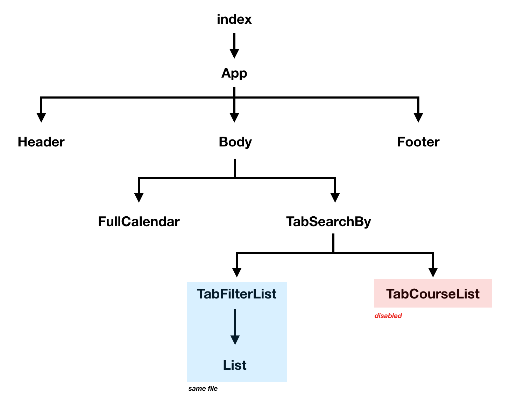

CSCoursePlanning
=====
This is final-project for CS485 Web Application Development (Computer Science Thammasat University) that build by MERN Stack

Project Folder
-----
Folder are split into 2 main parts

```--- client //contain React.js```

```--- server //contain MongoDB Express.js Node.js```

Deployment
-----
**client folder**
> npm install && npm start

``` application will launch in localhost:3000 ```

**server folder**
> npm install && npm start

> mongod --dbpath <relative path to ~/server/db/>

``` application will launch in localhost:4000 ```

**docker**
> in comming


Collabolators
----
* [5809610248 Nitipat Wuttisasiwat (**Ken**)](https://github.com/kennaruk)
* [5809610396 Tanakorn Peetivorapat (**Boom**)](https://github.com/Tanakornl3oom)
* [5809680019 Nattanon Yanil (**Card**)](https://github.com/eieizahahayo)
* [5809680035 Peerason Hemsart (**Big**)](https://github.com/bique14)
# Client Folder

## React file Structure

***why disabled TabCourseList ?***

---------

## DONE 
- แก้บัคปุ่มชั้นปี ภาคเรียน
- Set วันให้ตรง
- เช็ควิชาเรียน 2 วัน
- เช็คหน่วยกิตไม่เกิน 21
- วิชาเรียนก่อนหน้า (prerequisite)
- ใส่สีตามวัน ให้ดูง่าย
- แก้บัค ```หลังเช็ค prerequisite เสร็จแล้ว ถึงแม้จะถูก และไม่ขึ้นใน calendar แต่ปุ่มยังถูก selected อยู่```

## NOT DONE
- Overlap วิชาที่ทับกัน
- Save button สำหรับเซฟตารางเรียน
- ต่อ API

## BUG
- หลังเช็ค prerequisite เสร็จแล้ว แสดงผล unselected ผิดพลาด

Test case | Expected | Actual
--- | --- | ---
คลิ๊กเลือก CS111<br>จากนั้นคลิ๊กเลือก CS213  | ขึ้น alert และ row CS213 ไม่ถูก select <br> แต่ row CS111 ยัง select เหมือนเดิม | ขึ้น alert และ row CS213 ไม่ถูก select <br> แต่ row CS111 __ไม่ถูก select__

---
- หลังจากที่ serach by course id แล้ว select จะเกิดบัคคือของจะถูกหยิบมาผิด เหมือนก่อนที่จะ serach
(น่าจะเพราะเรียงตามแถว จากฟังก์ชั่น _onRowSelection ที่เอาแถวที่เลือก(key)เป็น index ของวิชา)

Test case | Expected | Actual
--- | --- | ---
เสิร์ชว่า CS211 | กดเลือก CS211 แล้ว add event CS211 ใน Calendar | กดเลือก CS211 แล้ว add event __CS101__ ใน Calendar

---
- disabled ปุ่ม course list แบบที่เลือกตาม cs1xx cs2xx ออก เพราะคิดว่าไม่จำเป็น(เพราะมี serach แล้ว) และมีบัคเยอะ (ถ้าจะใช้ก็เอา disabled ออก อยู่ที่ไฟล์ TabSearchBy บรรทัดที่ 40, 45)

---
